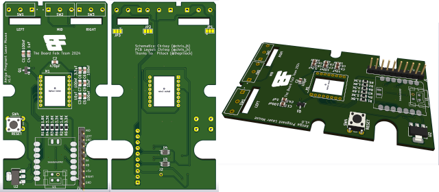

# Amiga Pregnant Laser Mouse
 An optical mouse replacement pcb for the Amiga pregnant mouse

 

Version 1.0

Requires an XAIO SAMD21 and a ADNS9800 Laser, which you can get still get from Aliexpress. Make sure to also get the Lens.

[**SMD Interactive BOM**][IBOMSMD]

[Gerbers](https://github.com/Board-Folk/PregnantLaserMouse/blob/main/production/Amiga_Pregnant_Laser_Mouse_1.0.zip)

Software [see here](https://github.com/Board-Folk/PregnantLaserMouse/tree/main/SW)

## 3D Printable Mouse

A fully printable Amiga pregnant Mouse is available here

[Amiga - "Pregnant" Mouse (3-button)](https://www.printables.com/model/966841-amiga-pregnant-mouse-3-button)

This is what i used to test my PCB within.

## 3D Printable Lens Cover

3D Printable Lens Cover still requires testing, Sketchup model file is included to modify for tolerances of your printer.

***Print Settings***

* Layer Height : 1.5mm
* Print Speed : 25 mm/s
* Initial Layer Speed: 15mm
* Support: Yes
* Infill: 20%
* Line Width: 0.4mm
* Print Thin Walls: Yes
* Filter Out Tiny Gaps: Yes

## Thanks

  * Pillock ([@thepillock])
&nbsp;
  * The rest of the Board Folk Team for their support and general
    coolness.\
&nbsp;
  * ADNS9800 interface based on code from https://github.com/mrjohnk/ADNS-9800
  * QUADRATURE interface based on blog from http://danceswithferrets.org/geekblog/?p=742

## !!!!! WARNING !!!!!
Don't Plug in the USB to the XAIO while connected to the Amiga/Computer, as this will join the 5V together and may damage something.

This is still a work in progress, use at your own risk. I accept no responsibility if this damages any of your equipment.

[IBOMSMD]: http://htmlpreview.github.io/?https://raw.githubusercontent.com/Board-Folk/PregnantLaserMouse/main/bom/PregnantMouseBom.html

