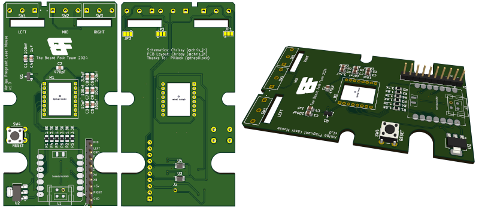

# Amiga Pregnant Laser Mouse
 An optical mouse replacement pcb for the Amiga pregnant mouse

 

Version 1.0

Requires an XAIO SAMD21 and a ADNS9800 Laser, which you can get still get from Aliexpress. Make sure to also get the Lens.

## Notes

In commodore's wisdom, there are differences in the mouse button pcb layput between the 2 button and 3 button versions.
By default i have set the orientation in the 2 button version, as i did not have access to the 3 button pcb layout and they looked identical from the top.

* JP1 - Left Mouse Button Orientation
* JP2 - Middle Mouse Button Orientation
* JP3 - Right Mouse Button Orientation

These are the jumpers underneath the board. Break the traces between the 1st and 2nd pad, and solder between the 2nd pad and 3rd, if you want to use 3 button mouse version.

I will probably make a Version 1.1, and join both anyway and if someone finds a switch that is not compatible, to cut the one not needed.

Make sure that you put the switches in the correct orientation also on the PCB that they alignup and hit the tab on the button before soldering.

## Bom

[**SMD Interactive BOM**][IBOMSMD]

[Gerbers](https://github.com/Board-Folk/PregnantLaserMouse/blob/main/production/Amiga_Pregnant_Laser_Mouse_1.0.zip)

Software [see here](https://github.com/Board-Folk/PregnantLaserMouse/tree/main/SW)

## 3D Printable Mouse

A fully printable Amiga pregnant Mouse is available here

[Amiga - "Pregnant" Mouse (3-button)](https://www.pcbway.com/project/shareproject/Amiga_Pregnant_Mouse_3_button_version_f910c5ea.html)

This project also includes varient for the optical ADNS 9800

* Shell - Bottom (Laser variant)
* Shell - Top
* Shell - Buttons

## 3D Printable Lens Cover for the Original Mouse

3D Printable Lens Cover (lens.stl) still requires testing, Sketchup model file is included to modify for tolerances of your printer.

***Print Settings***

* Layer Height : 1.5mm
* Print Speed : 25 mm/s
* Initial Layer Speed: 15mm
* Support: Yes
* Infill: 20%
* Line Width: 0.4mm
* Print Thin Walls: Yes
* Filter Out Tiny Gaps: Yes

## 3D Printable PCB Holder

The (holder.stl) is just to well, hold the PCB in place. May or may not be needed.

## Thanks

  * Pillock ([@thepillock])
&nbsp;
  * The rest of the Board Folk Team for their support and general
    coolness.\
&nbsp;
  * ADNS9800 interface based on code from https://github.com/mrjohnk/ADNS-9800
  * QUADRATURE interface based on blog from http://danceswithferrets.org/geekblog/?p=742

## !!!!! WARNING !!!!!
Don't Plug in the USB to the XAIO while connected to the Amiga/Computer, as this will join the 5V together and may damage something.

This is still a work in progress, use at your own risk. I accept no responsibility if this damages any of your equipment.

[IBOMSMD]: http://htmlpreview.github.io/?https://raw.githubusercontent.com/Board-Folk/PregnantLaserMouse/main/bom/PregnantMouseBom.html

